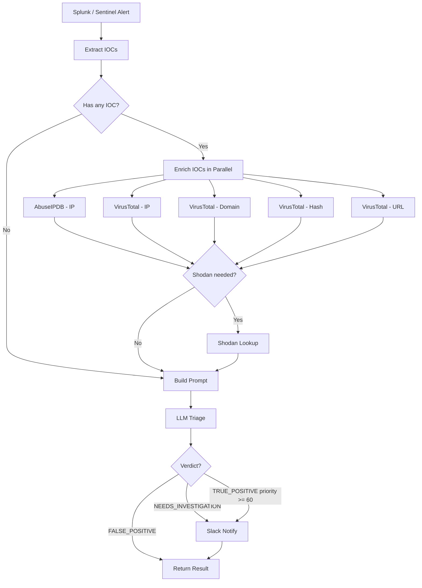

# Alert Triage Agent

AI SOC Agent is a FastAPI-based security triage service that receives Splunk and Sentinel alerts, normalizes them into a shared format, extracts IOCs, enriches network indicators (IPs, domains, hashes, URLs), optionally queries Shodan, and returns a structured LLM-assisted triage result.

## Features

- Splunk and Sentinel webhook support
- IOC extraction from incoming alerts (IPs, hostnames, usernames, file hashes, domains, URLs)
- IP enrichment via AbuseIPDB and VirusTotal
- Domain, file hash, and URL enrichment via VirusTotal
- Optional Shodan lookup for exposed hosts
- Optional urlscan.io lookup for URLs
- LLM-based triage verdict generation via Ollama local models
- SQLite-backed caching for enriched IOCs (24h TTL)
- Slack notifications for high-priority alerts
- Parallel enrichment — all IOCs and providers queried concurrently

## Setup

1. Clone the repository.
```bash
git clone https://github.com/Mohkith/SOC-AI-agent.git
cd SOC-AI-agent
```

2. Create and activate a virtual environment (using `uv`).
```bash
uv venv
# Windows
.\.venv\Scripts\activate
# macOS / Linux
source .venv/bin/activate
```

3. Install dependencies.
```bash
pip install -r requirements.txt
```

4. Create your environment file and fill in your API keys.
```powershell
# Windows
copy .env.example .env

# macOS / Linux
cp .env.example .env
```

5. Add your API keys to `.env` (see [Environment Variables](#environment-variables) below).

## Environment Variables

| Variable | Required | Description |
|---|---|---|
| `ABUSEIP_API_KEY` | Yes | AbuseIPDB API key for IP reputation |
| `VT_API_KEY` | Yes | VirusTotal API key for IP, domain, hash, and URL enrichment |
| `OLLAMA_BASE_URL` | No | Ollama endpoint (default: `http://localhost:11434`) |
| `OLLAMA_MODEL` | No | Model name (default: `nemotron-3-super:cloud`) |
| `OLLAMA_API_KEY` | No | Bearer token for Ollama (if using a remote/authenticated endpoint) |
| `SHODAN_API_KEY` | No | Shodan API key — skipped silently if not set |
| `US_API_KEY` | No | urlscan.io API key — skipped silently if not set |
| `SLACK_WEBHOOK_URL` | No | Slack incoming webhook URL for triage notifications |

At minimum, set `ABUSEIP_API_KEY`, `VT_API_KEY`, and configure at least one LLM endpoint. All other keys are optional — the service degrades gracefully when they are missing.

## Run the App

```bash
uvicorn main:app --reload --port 5000
```

Or run directly:
```bash
python main.py
```

## Example Request

Test with the included sample Splunk alert:
```bash
curl -X POST http://localhost:5000/webhook/splunk \
  -H "Content-Type: application/json" \
  --data "@splunk_payload.json"
```

Or send a raw JSON payload:
```bash
curl -X POST http://localhost:5000/webhook/sentinel \
  -H "Content-Type: application/json" \
  -d '<sentinel alert json>'
```

## How It Works



## Project Structure

| File | Description |
|---|---|
| `main.py` | FastAPI app, webhook routes, and Slack interactivity |
| `graph.py` | LangGraph workflow and conditional branching |
| `schemas.py` | Pydantic and SQLModel data models |
| `adapters.py` | Splunk and Sentinel payload normalization |
| `enrichment.py` | AbuseIPDB, VirusTotal, and urlscan.io enrichment helpers |
| `shodan_client.py` | Shodan lookup logic |
| `llm_client.py` | LLM triage request and JSON parsing with retry |
| `db.py` | SQLite cache and enrichment entry point |
| `prompts.py` | System prompt and prompt construction |
| `decisions.py` | Routing decisions (Shodan threshold logic) and internal ip check |
| `ioc_extract.py` | IOC extraction |
| `slack.py` | Slack Block Kit message formatting |
